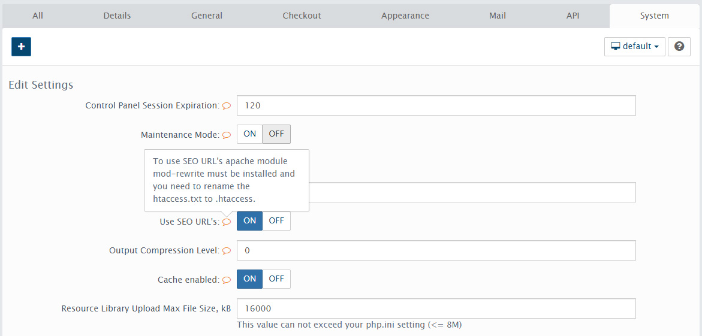

I just have the privilege to learn more about AbanteCart and by default the SEO URL&#8217;s need to be turned on to make use of it. If you are using Apache as your server with mod_rewrite enabled, all you have to do is rename `htaccess.txt` to `.htaccess` in your AbanteCart\'s `public_html` folder and then turn on the &#8220;Use SEO URL&#8217;s&#8221; in System Settings.

To learn more about enabling AbanteCart SEO settings on Apache server, I have detailed it in another [post][1].



But how do we make it work when we&#8217;re Nginx server? We need to translate/convert the contents <span class="file">.htaccess</span> into our nginx config file.

Here below is the SEO URL rules inside the <span class="file">.htaccess</span> file.

```
# SEO URL Settings
RewriteEngine On
RewriteBase /
RewriteCond %{REQUEST_FILENAME} !-f
RewriteCond %{REQUEST_FILENAME} !-d
RewriteRule ^(.)\?$ index.php?_route_=$1 [L,QSA]
```

And this is the corresponding conversion.

```
location / {
    try_files $uri $uri/ $uri.php @abantecart_rules;
}

location @abantecart_rules {
    rewrite ^(.)\?$ /index.php?_route_=$1 last;
}
```

Now, that&#8217;s pretty much like it. The `@abantecart_rules` does its job for us to rewrite the URL from query strings to its corresponding pretty URL which you can generate in the product&#8217;s general settings page or customized it the way you want it. And there you have it, you just got AbanteCart SEO URL working.

Here&#8217;s a complete <a href="https://github.com/dorelljames/abantecart-snippets/blob/master/abantecart-nginx-sample.conf" target="_blank">sample nginx configuration</a> if you want a more detailed reference and I&#8217;ve covered there all of the `.htaccess` rules.

Questions, anything, just let me know in your comments. Thanks

[1]: #coming-up
[2]: https://i0.wp.com/dorellwp.localhost//wp-content/uploads/2015/02/abantecart-seo-settings.jpg
