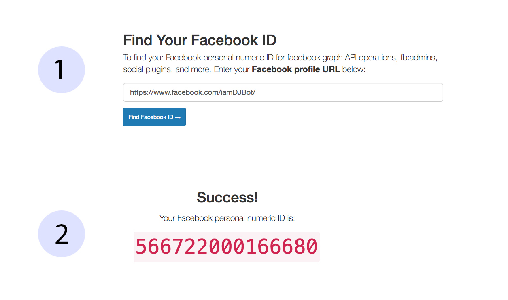
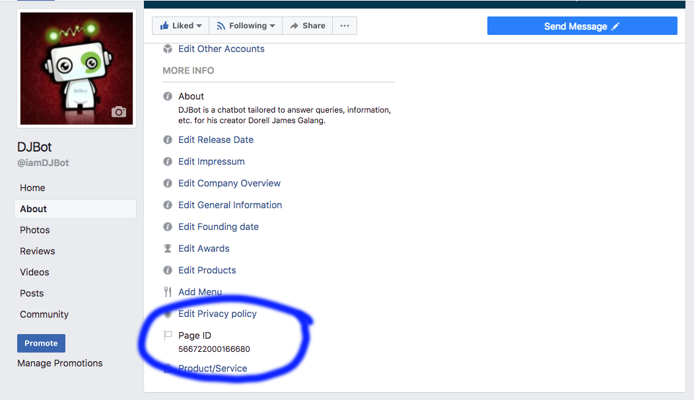
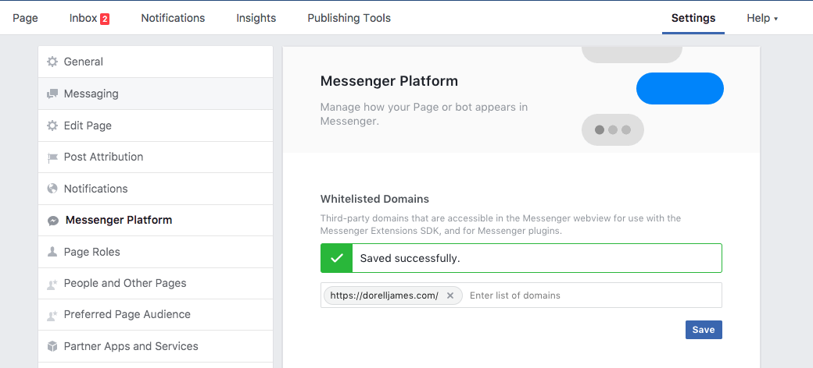
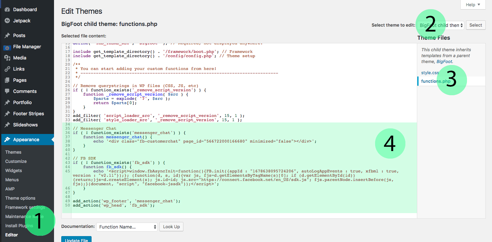

Facebook recently made available in open beta their [Messenger Customer Chat Plugin][1] which allows you to integrate your Messenger experience directly into your website.

> Are you interested in using a WordPress Plugin on this?
>
> If yes, search <a href="https://wordpress.org/plugins/wp-messenger-customer-chat/">WPMCCP</a> at WordPress Plugins. Activate, and then follow the instructions. <a href="/wordpress-messenger-customer-chat-plugin-installation/"><strong>Watch how-to video here</strong></a>.
>
> NOTE: If you use this plugin, skip the guide below and/or undo what you did as per this guide.

But how do you integrate this into your WordPress site? Of course, there will be probably a lot of plugins created by now to do that easily but why not do it yourself for such a simple thing?

Here's how you do it in as easy as 1, 2, 3&#8230;

1.) Let's look up your **Facebook Page ID** which we need in Step 2. For this, let's use a free service at <a href="https://findmyfbid.in/" target="_blank" rel="noopener">Find Your Facebook ID</a> and paste your Facebook Page URL.

E.g.: https://www.facebook.com/pg/iamDJBot.

**IMPORTANT: Take note of the number.**



Alternatively, you can go to your **Facebook Page** > **About** and scroll down bottom until you see **Page ID**.



2.) Add your website's domain to **Whitelisted Domains** on your Facebook Page. Go to your **Facebook Page** > **Settings** > **Messenger Platform** then scroll below and find **Whitelisted Domains**.

E:g: http://dorellwp.localhost



3.) Open your theme's `functions.php` file. If you're using a child theme, use that one (_definitely better_).

In WordPress sidebar menu, go to **Appearance** > **Editor**. Make sure that your **active theme** is selected. Then, locate the `functions.php` file on the right side and click that.



> **NOTE: Please proceed with caution with the code below and make sure to copy and paste it properly or it may break your site and you need to manually remove the faulty code to fix your WP site. Rest assured, the code below works without problems.**
>
> **NOTE: If your `functions.php` file is empty, make sure to input the opening php tag and append the code below (few lines after).**

```php
<?php

// Insert the code here...

?>
```

**NOTE: If your `functions.php` file is not empty, make sure not to paste the code below after the closing php tag.**
**See `?>`**

```php
// Insert the code here..
// Some code here...

?>

// DO NOT INSERT CODE HERE

```

**Here's the right way below&#8230;**

```php
<?php

// Insert the code here... This is the line after the PHP opening tag and/or before the PHP closing tag
// If you have existing code, do not clear them out but just paste it above or below but always remember insert in between the opening and closing tags

?>
```

You may now paste the following code below (append it to the bottom part). Make sure to replace **`<YOUR_FACEBOOK_PAGE_ID>`** from Step 1.

```php
// Messenger Chat
if ( ! function_exists('messenger_chat') ) {
    function messenger_chat() {
        echo '<div class="fb-customerchat" page_id="<YOUR_FACEBOOK_PAGE_ID>" minimized="false"></div>';
    }
}

// FB SDK
if ( ! function_exists('fb_sdk') ) {
    function fb_sdk() {
        echo '<script>window.fbAsyncInit=function(){FB.init({appId : "1678638095724206", autoLogAppEvents : true, xfbml : true, version : "v2.11"});}; (function(d, s, id){var js, fjs=d.getElementsByTagName(s)[0]; if (d.getElementById(id)){return;}js=d.createElement(s); js.id=id; js.src="https://connect.facebook.net/en_US/xfbml.customerchat.js"; fjs.parentNode.insertBefore(js, fjs);}(document, "script", "facebook-jssdk"));</script>';
    }
}

add_action('wp_footer', 'messenger_chat');
add_action('wp_footer', 'fb_sdk');
```

Replace **`<YOUR_FACEBOOK_PAGE_ID>`** with your **Facebook Page ID**. Save. Hooray!

[1]: https://developers.facebook.com/docs/messenger-platform/discovery/customer-chat-plugin
