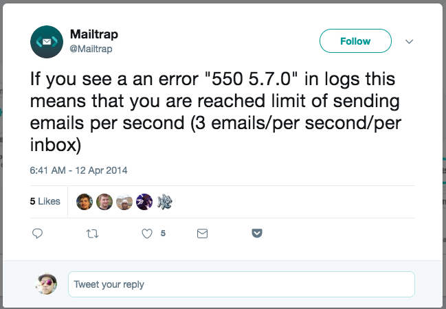

So today in my usual development job, I stumbled on an **error 550 (too many emails per second)** using [**Mailtrap**][1] because I'm sending a lot of emails at once (probably 50 in a second). This most probably won't happen on your mail provider but sure Mailtrap did put a limit on this and that you can only **send 3 emails per second**. See below:



In order to solve this, we need to **limit and only send 3 maximum per second** or else we'll risk getting our connection cut and the rest of the emails not being sent. I was using <a href="https://nodemailer.com/about/" target="_blank" rel="noopener">NodeMailer</a> package on my NodeJS app and luckily this can be easily be done by using Pooled SMTP and additional options. Read <a href="https://nodemailer.com/usage/bulk-mail/" target="_blank" rel="noopener">this guide</a> for more information.

- **pool** – set to *true* to use pooled connections (defaults to *false*) instead of creating a new connection for every email
- **maxConnections** – is the count of maximum simultaneous connections to make against the SMTP server (defaults to 5)
- **maxMessages** – limits the message count to be sent using a single connection (defaults to 100). After *maxMessages* is reached the connection is dropped and a new one is created for the following messages
- **rateLimit** – limits the message count to be sent in **rateDelta** time. Once *rateLimit* is reached, sending is paused until the end of the measuring period. This limit is shared between connections, so if one connection uses up the limit, then other connections are paused as well. If *rateLimit* is not set then sending rate is not limited

So in **createTransport** code and options, limiting 3 per second would translate with the following options below:

```js
transporter = nodemailer.createTransport({
  host: "smtp.mailtrap.io",
  port: 2525,
  auth: {
    user: process.env.MAILTRAP_USER,
    pass: process.env.MAILTRAP_PASSWORD,
  },
  pool: true, // use pooled connection
  rateLimit: true, // enable to make sure we are limiting
  maxConnections: 1, // set limit to 1 connection only
  maxMessages: 3, // send 3 emails per second
})
```

That's it folks. Hopefully you save yourself some time solving your way out that _error 550 (too many emails sent)_ using Mailtrap.

[1]: http://mailtrap.io
