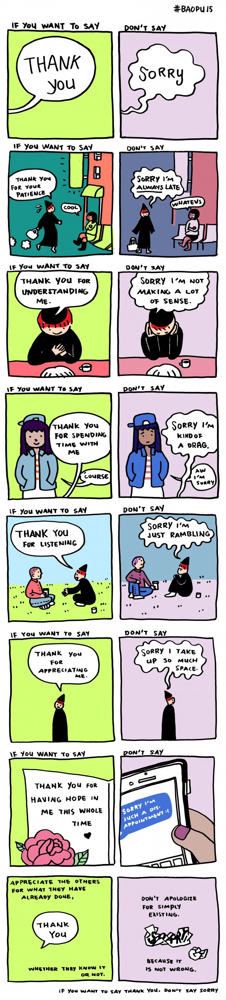

How often do you tell someone you are **&#8220;Sorry&#8221;**?

Well, it's always a good thing to be aware of the things we fall short of. But sometimes, they seemed to be unnecessary and you might instantly knock off the mood insisting for things that were totally okay in the first place. So, if you're like me who kind of have a habit of saying **&#8220;Sorry&#8221;** most of the time, then maybe it's about time for us to rethink about it and say **&#8220;Thank You&#8221;** instead? 

<a target="_blank" ref="nofollow" href="http://www.yaoxiaoart.com/">Yao Xiao</a> (a china born illustrator based in New York City) perfectly explains why we should practice saying more **“THANK YOU”** instead of **“SORRY”** with her cartoon.

How about that for the coming year 2016? Enjoy your day! 
