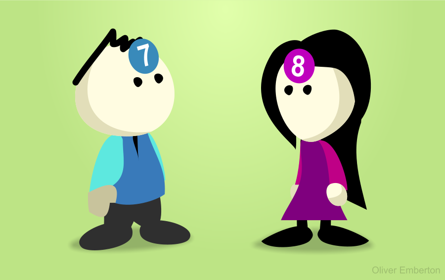
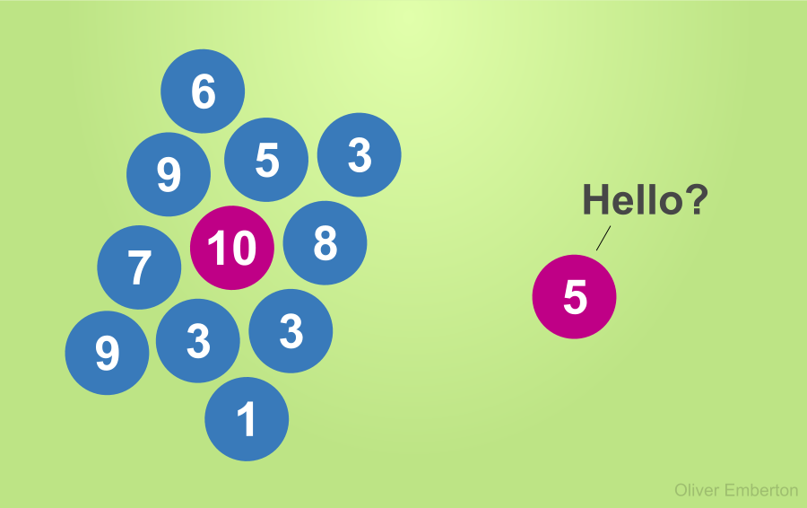
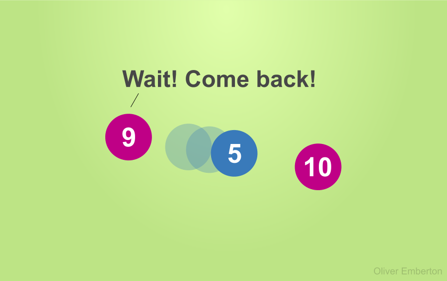

#### _Let's play a mating game._

Put 100 men and 100 women in a sealed room. On each person's forehead, write a random number from 1 to 10, and call that their 'attractiveness'.

You're not able to see the number on your forehead, and no-one will tell you what it is either. The game is to pair up with the highest ranked person of the opposite sex that you can.

Ready? Go.

Pretty much immediately, any nines and tens are surrounded by huge crowds vying for their attention.

If the crowds flock towards you, you know your score must be pretty damn good. If strangers flee as you approach &#8211; not so much.

People will lower their expectations when rebuffed, and raise them when surrounded. If every single person you meet wants to pair with you, you'll probably never settle for less than a ten.

But for everyone else, you're forced to guess and gamble. And the clue to your attractiveness is how needy other people act around you.

This game is simpler than real life, but the essence holds: if someone is desperate to be with you, chances are they think you're better than they are. They may be utterly wrong, but that's what they're conveying.

Conversely, if someone is aloof with their affections, they probably think they can do better. They may also be wrong, but in both cases we're wired to interpret this as feedback on our own attractiveness. You're trying to guess the number on your head, and their feedback is all you have.

You can't help being influenced by this, and it's one reason why 'playing it cool' is such an attractive trait, even if it's such an easily contrived one. Being needy essentially says &#8220;you're so much better than me, please pick me&#8221;. Not a great sales pitch.

Neediness is repulsive because we've evolved to recognise it as a bad signal. It's like a fear of spiders or scorpions: a primal instinct which protects our best interests, even if we don't understand why.

If this strikes you as depressing and soulless, take heart.

Real life has a few extra qualities that make it less of a one-dimensional meat market. For one: all numbers can change. But most of all: everyone sees a slightly different number when they look at each other.

Originally shared on <a href="http://www.quora.com/Psychology/Why-is-neediness-such-a-repulsive-characteristic" target="_blank">Quora</a> and of course all credits go to <a href="http://www.quora.com/Oliver-Emberton" target="_blank">Oliver Emberton</a>
