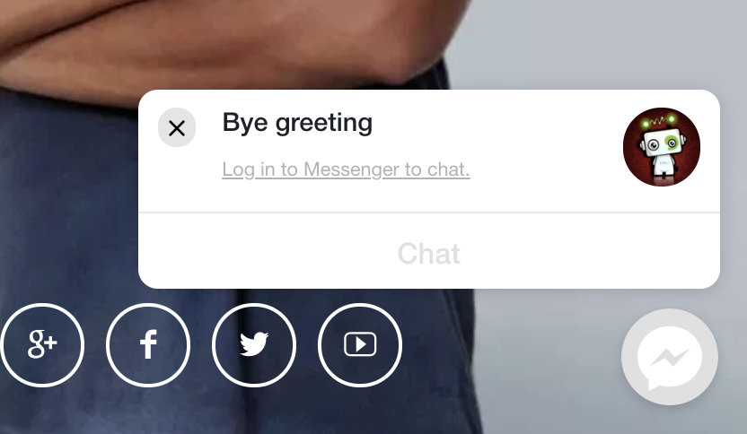
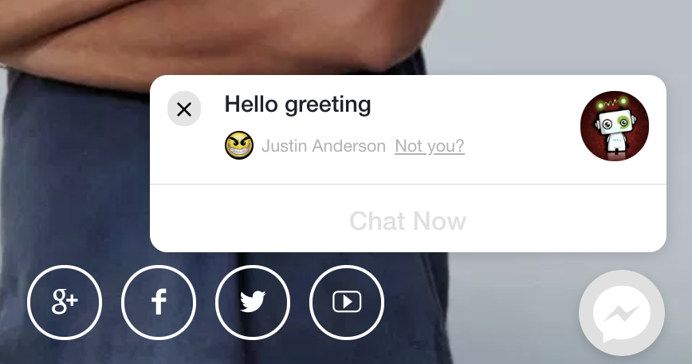
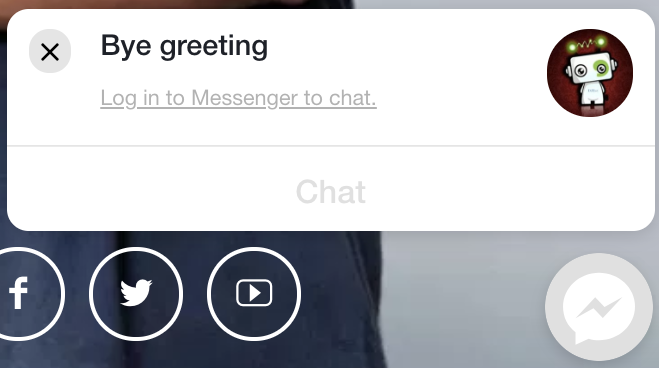

Hey there folks, an update to **<a href="https://wordpress.org/plugins/wp-messenger-customer-chat/" target="_blank" rel="noopener">WordPress Messenger Customer Chat Plugin (WPMCCP)</a>** should be available now.

## Release Versions

**1.5** - small but important update to keep the plugin working. Please update the soonest! Switched and now using [Customer Chat SDK.][1]

**1.4** - primarily focus on improving the messenger experience by customizing the greeting texts for logged in and logged out users as well as changing the theme color of Messenger.

## Customizations

In _Customize_ tab of plugin settings you can find the following options below:

1. **Theme Color** - You can specify a hex color value to change the default theme color of messenger chat plugin.

2. **Logged In Greeting Text** - You might want to customize the text greeting for logged in users like for example &#8220;Hello greeting&#8221;. See below:

3. **Logged Out Greeting Text** - You might want to customize the text greeting for logged out users like for example &#8220;Bye greeting&#8221;. See below:

4. **Dialog Display** - Should you customize the behavior whether messenger should appear or not appear or a little bit of fading? This option gives you that.

5. **Dialog Delay** - Should you set a delay before the greeting text appears? This is it.

[1]: https://developers.facebook.com/docs/messenger-platform/discovery/customer-chat-plugin/sdk
