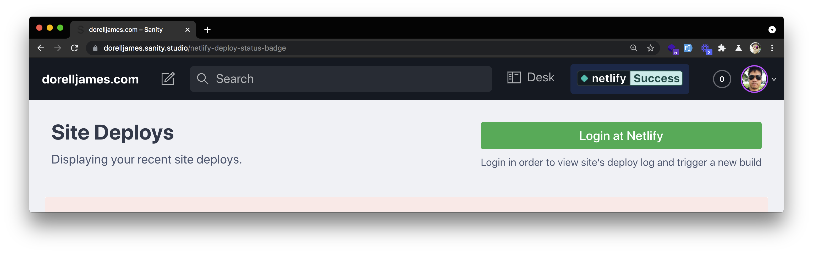
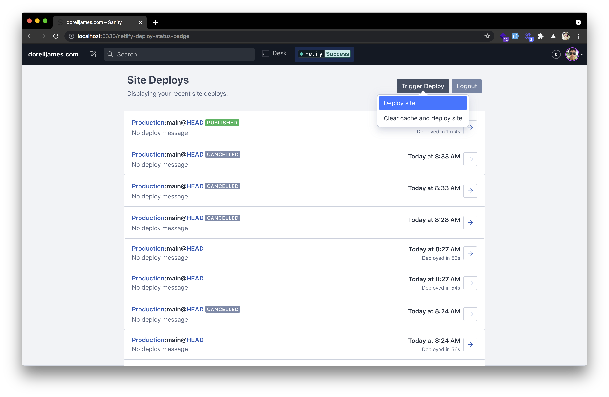
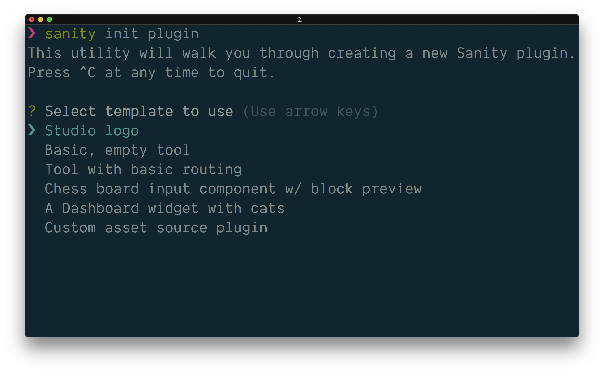
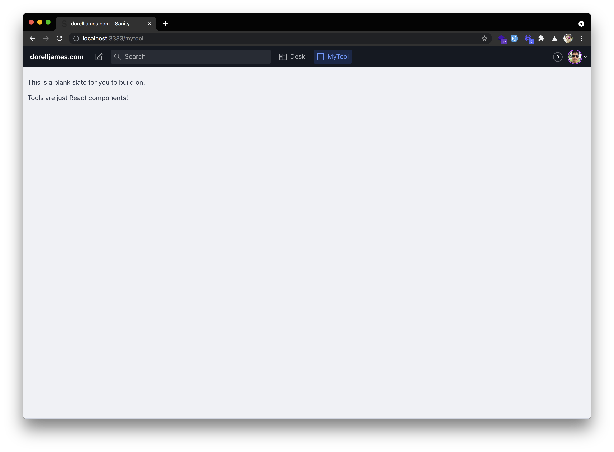
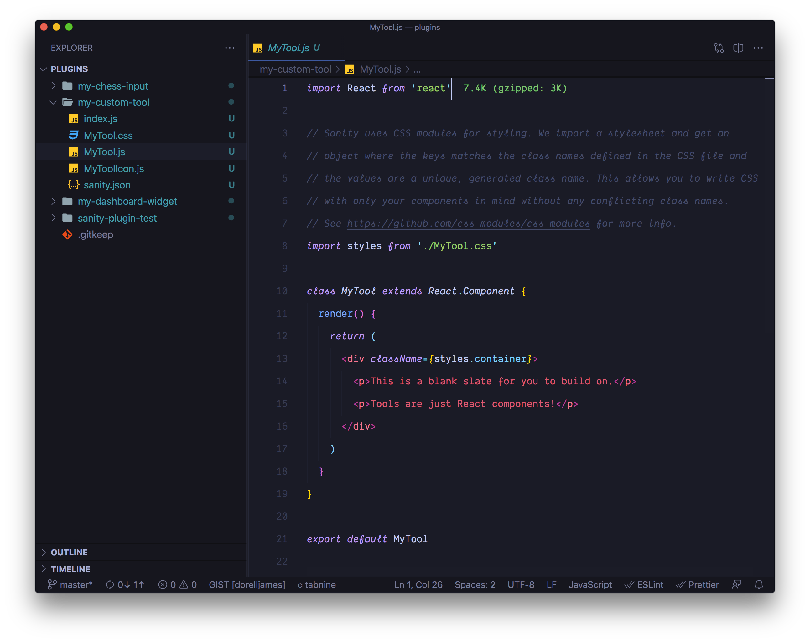

I recently published [sanity-plugin-netlify-deploy-status-badge](https://www.npmjs.com/package/sanity-plugin-netlify-deploy-status-badge) - a Sanity studio plugin that displays your Netlify's site build status.



It also displays the latest deploys of your site - UI/UX looks like a carbon copy of Netlify App's deploys page. Oops, sorry! 😅



To make it even more useful, I added triggering a new build function behind an authentication mechanism thanks to Netlify's OAuth.

This isn't my first attempt at creating a plugin, and even though the first one never made it to the finish line, the hours spent on it were carried over to this one. So, really, all good. 😊

## What is a plugin?

In a nutshell, and in my definition, a plugin extends the functionality of an existing app.

In Sanity, you can do as much and from a basic tool to one with routing, or a custom input component, or creating a dashboard using widgets or providing a custom asset source. Like really, the limit is up to your imagination.

## Creating the plugin

The easiest way to get started with creating a plugin is to run the command:

```bash
$ sanity init plugin
```

This will bootstrap us and allow us to choose a template for the possible type of plugin we're going to create.



Out of all the options here, I found the **"Basic, empty tool"** the easiest as it gave me quick feedback on how this plugin works plus there's not a lot of files to scan through. It basically creates a new menu item named **"MyTool"** in the top bar. Clicking on that gives us an almost blank page like below.



If you take a look at the source code at `plugins` directory, you'll find that `MyTool.js` is just your typical [React Class component](https://reactjs.org/docs/components-and-props.html#function-and-class-components). You might ask if we could write a Function component? The answer is, yes, of course. The thing I'm not sure though is whether if it's better to write a Class component than a Function component. Do you guys know? Please share your thoughts in the comments below this post.



Anyhow, you should be able to find `sanity.json` in the plugin directory and if you click on that, you'll find the following contents below.

```json
{
  "parts": [
    {
      "implements": "part:@sanity/base/tool",
      "path": "./index.js"
    }
  ]
}
```

To be honest, when I first encountered the above, it just didn't make sense to me at all. Maybe I was just bad at specifying the right keyword to Google at that time, but I didn't really found an answer to this until later.

"Everything in Sanity is a plugin", they said. The above is what they call the _Part System_. You can [read more on that here](https://www.sanity.io/docs/parts) but in a nutshell, Sanity is assembled from these so-called `parts` and plugins are basically a collection of "parts" that either add or replace or amend the original Sanity parts.

I found this Sanity plugin called [Parts List.](https://www.sanity.io/plugins/parts-list) You can install it if you want to get to know more parts as it'll list them down for you. And to really get to understand these things, this [intro from Sanity really helps](https://www.sanity.io/docs/plugin-custom-logo).

## My Sanity Plugin Requirements

Disclaimer: This plugin is basically just scratching my own itch and with a little hope that others may find it useful. My site is happily hosted at Netlify and I wanted a way to see how my site is doing without having to go to [Netlify app](https://app.netlify.com) and switch back and forth. Before I went to write this plugin, I went to [Sanity.io plugins directory](https://www.sanity.io/plugins) and NPM to find if such a thing already existed and I got excited when I found there's none yet.

My idea was pretty simple, show the Netlify status badge up there and update it real-time. Sooner, I realized that I also need to show the latest deploys as well to understand what's going on with my site and update them too continuously, and lastly, well, I thought, there are cases when I want to trigger a new build right here and there, so I thought, let's also add that.

So to summarise, here below:

☑️ Display Netlify's Status badge and update real time.  
☑️ Display my site's deploys and update them real time.  
☑️ Trigger a new build.

To be honest, I wasn't able to come up with that clean list above when I first started. And I think you'll find yourself in the same situation. If I may throw a piece of advice, just keep it simple. Simple that it does its job and it does it very well.

## Building The Plugin

I won't go step by step on detailing how I created everything but instead, I'll tell you things where I tripped and had difficulty building this plugin.

To begin with, I bootstrapped the plugin using [sanipack](https://www.sanity.io/plugins/sanipack) made by Espen (_Principal Engineer at Sanity.io_). You don't need to use this tool at all if you know how to set things up yourself.

According to the FAQ (_derived_):

> "If you just make sure your Sanity plugin is ES5-compatible and that your `sanity.json` and any references parts refer to the right directories, and you're good to go."

### First problem, how to get the value from Sanity plugin config?

I thought if I wanted this plugin to be used by others, I need to make sure that they could specify their own Netlify site id.

So, the first problem I had is how to use the key/values specified in my plugin's config marked with the filename of `<name-of-plugin>.json` (`netlify-deploy-status-badge.json`) in Sanity Studio's `config` directory.

So, let's say if I have the following below as content:

```json
{
  "apiId": "<YOUR-NETLIFY-API-OR-SITE-ID-HERE>"
}
```

The solution is simple, in my plugin, I just need to import like this below:

```json
import config from "config:<name-of-plugin>";
```

where `<name-of-plugin>` is of course `netlify-deploy-status-badge`.

So, the import will be now:

```json
import config from "config:netlify-deploy-status-badge";

console.log(config.apiId) // <YOUR-NETLIFY-API-OR-SITE-ID-HERE>
```

See [plugin's config helper file here](https://github.com/dorelljames/sanity-plugin-netlify-deploy-status-badge/blob/master/src/config.js) as an example.

### Next problem, how to resolve Sanity UI and Sanity Icons import errors?

While I bootstrapped my plugin using sanipack, I actually created it inside the `plugins` directory. As you may know, since both `@sanity/ui` and `@sanity/icons` are already included in Sanity Studio, I never ran into problems using those two. And even when I imported functions from `date-fns` later on. But when I moved it out, and test using [npm link](https://docs.npmjs.com/cli/v7/commands/npm-link/), I immediately saw a huge pile of import errors.

To solve this issue, I needed to install both [@sanity/ui](https://www.sanity.io/ui/docs) and [@sanity/icons](https://www.npmjs.com/package/@sanity/icons) as **dependencies** in my plugins folder. I also went to add [date-fns](https://www.npmjs.com/package/date-fns) as well as it allowed me to format dates easier. I thought I don't need the last one but I guess the comfort it gave won me over this time. And oh, lastly, I need to install [styled-components](https://styled-components.com/) as it is also a dependency of Sanity UI. Yay!

```json
...
"dependencies": {
  "date-fns": "^2.21.3",
  "prop-types": "15.7.2",
  "@sanity/icons": "^1.0.6",
  "@sanity/ui": "^0.33.19",
  "styled-components": "^5.2.3"
},
...
```

See [package dependencies here.](https://github.com/dorelljames/sanity-plugin-netlify-deploy-status-badge/blob/master/package.json#L22-L26)

And lastly, you'll have to import `studioTheme` and `ThemeProvider` from `@sanity/ui` and make sure to wrap your primary component with it. See the example below:

```jsx
import { ThemeProvider, studioTheme, Container, Text } from "@sanity/ui"

export default function PrimaryComponent() {
  return (
    <ThemeProvider theme={studioTheme}>
      <Container>
        <Text>Yay! This works now...</Text>
      </Container>
    </ThemeProvider>
  )
}
```

See this [Getting Started guide](https://www.sanity.io/ui/docs) to learn more.

---

And I guess that's pretty much it. I guess the other things were pretty much about the logic of the app. And maybe perhaps, I don't remember them as much before. Remember, this is the second time I tried and I've pretty much learned things I didn't know before.

Thank you for reading up until here. I hope you can at least get something useful from this article to compensate for the time you've spent reading this.

## What's next?

Build your own Sanity plugin! I think it's really important to really understand the `Part System` I mentioned in this article. I hope there was more documentation about it. I just try to make out of the examples of anything I can find. Probably a good tip is to browse the `node_modules` of the `@sanity` package you're working on. You'll find some examples there. 😉

## References

- Sanity Part System - [https://www.sanity.io/docs/parts](https://www.sanity.io/docs/parts)
- My First Plugin - [https://www.sanity.io/docs/plugin-custom-logo](https://www.sanity.io/docs/plugin-custom-logo)
- Sanipack - [https://www.sanity.io/plugins/sanipack](https://www.sanity.io/plugins/sanipack)
- Sanity UI - [https://www.sanity.io/ui/docs](https://www.sanity.io/ui/docs)
- Sanity Icons - [https://www.npmjs.com/package/@sanity/icons](https://www.npmjs.com/package/@sanity/icons)
- Sanity Plugins - [https://www.sanity.io/plugins](https://www.sanity.io/plugins)
