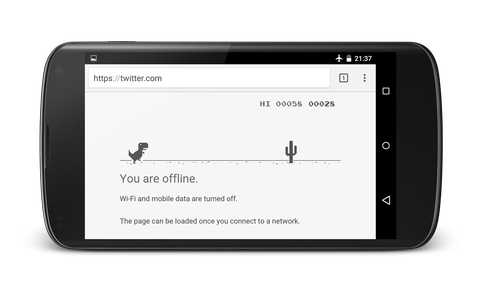

#### Ever having trouble connecting to the internet?

And your good day my friend just went south, eh? I know how it feels but instead of smashing the keyboard and totally getting pissed off, let me tell you something that you might not know and might spark a little bit of an interest to you.

#### Okay, what's is it?

I'm sure you've seen our T-rex friend showing up in (our favorite) Google Chrome browser from time to time now or probably at some time before. Our T-rex dinosaur friend shows up when our computer is not connected to the internet. Its short arms denote that a lot of things are out of its reach; so as Google Chrome. But wait, here's what's interesting is that our T-rex dinosaur is actually not just a simple display page but it's actually a game; Google Chrome's offline game.

#### Wait, what? A game?

Yes, and if you're seeing our T-rex dinosaur friend right now, press the &#8220;space&#8221; key on your keyboard and you'll see what I mean. The game is simple; your mission is to prevent it from bumping into those saguaros. So jump, jump all the way!

#### And lastly

This is not only on Chrome for desktop but it's available on your Chrome for Android as well. Now, switch to airplane mode and jump, jump, jump all the way. But wait, how do I do that? Instead of pressing the &#8220;space&#8221; key, tap the screen to begin.

Enjoy Google Chrome's offline game. Fly fly fly and away. I mean jump. 

[1]: #
